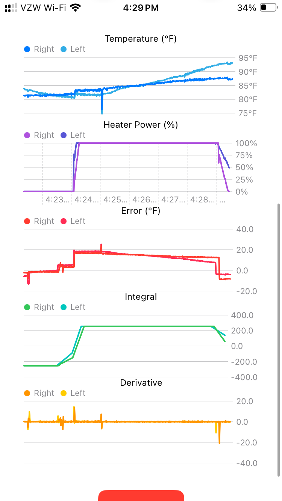
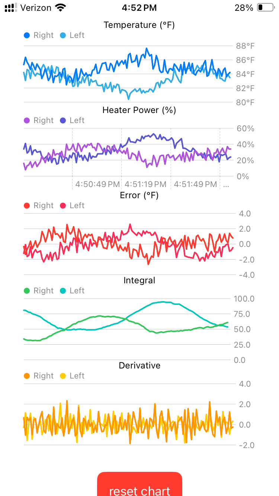

# Bootwarmer

A SwiftUI iOS app that controls a smart boot warming system via Bluetooth LE. The app connects to an ESP32-based device that manages heating elements in ski/snowboard boots.

## Hardware Overview

Here's the boot warming system hardware:

## Features

- Bluetooth LE connectivity to ESP32 device
- PID temperature control for precise heating
- Real-time temperature monitoring and adjustment
- User-friendly SwiftUI interface
- Battery level monitoring
- Multiple heating zones support
- Custom app icon with light/dark mode variants
- Energy-efficient operation

## Project Structure

The project consists of two main components:

### iOS App (SwiftUI)
- `src/Bootwarmer/` - Main iOS app directory
  - `BluetoothManager.swift` - Handles BLE communication
  - `ContentView.swift` - Main app interface
  - `BootwarmerApp.swift` - App entry point
  - `Assets.xcassets` - App icons and resources

### ESP32 Firmware
- `src/wifiESP32/bootwarmer/` - ESP32 Arduino firmware
  - `bootwarmer.ino` - Main firmware code for the ESP32

## Requirements

- iOS 14.0 or later
- Xcode 14.0 or later
- ESP32 development board
- Bluetooth LE support

## Building and Running

1. Open `src/Bootwarmer/Bootwarmer.xcodeproj` in Xcode
2. Select your target device or simulator
3. Build and run the project (⌘R)

For the ESP32:
1. Open `src/wifiESP32/bootwarmer/bootwarmer.ino` in the Arduino IDE
2. Select your ESP32 board and port
3. Upload the firmware

## Support

Need help? Check out our [support page](support.html) for troubleshooting and assistance.

## Privacy Policy

The privacy policy for the Bootwarmer app can be found [here](privacy_policy.html).

## License

This project is proprietary and not open for redistribution.
